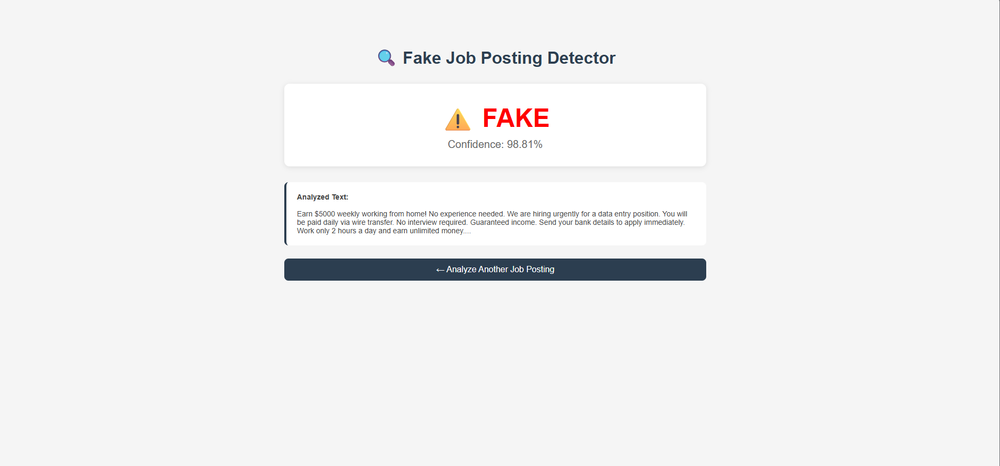

# 🔍 Fake Job Posting Detector

An NLP-based Machine Learning web application that detects fraudulent job postings in real-time.

Built to protect job seekers — especially freshers — from falling victim to fake job scams.

---


## 🚀 Live Demo
👉 [Click here to try the app](https://fake-job-detector-zo3h.onrender.com/)

Paste any job description → Get instant FAKE or GENUINE prediction with confidence score.



---

## 📌 Problem Statement

Thousands of fake job postings target job seekers every year, leading to financial fraud and data theft. Existing platforms lack real-time fraud detection tools accessible to common users. This project solves that gap using Machine Learning and NLP.

---

## 🛠️ Tech Stack

| Layer | Technology |
|-------|-----------|
| Language | Python 3.12 |
| ML Model | Logistic Regression |
| NLP | TF-IDF Vectorization, NLTK |
| Web Framework | Flask |
| Frontend | HTML, CSS |
| Dataset | Kaggle - Real or Fake Job Postings (17,880 records) |

---

## 📊 Model Performance

| Metric | Score |
|--------|-------|
| Accuracy | 96.42% |
| Fake Job Recall | 87% |
| Genuine Precision | 99% |
| Dataset Size | 17,880 records |

- Handled severe class imbalance (95% genuine vs 5% fake) using `class_weight='balanced'`
- Prioritized Recall over Precision for fake class to minimize missed fraud cases

---

## 📁 Project Structure
```
fake-job-posting-detector/
│
├── app.py                  # Flask web application
├── model.pkl               # Trained ML model
├── tfidf.pkl               # TF-IDF vectorizer
├── eda.ipynb               # Exploratory Data Analysis notebook
├── requirements.txt        # Dependencies
├── templates/
│   ├── index.html          # Home page
│   └── result.html         # Result page
└── static/                 # Static files
```

---

## ⚙️ How to Run Locally
```bash
# Clone the repository
git clone https://github.com/Abhi-91/Fake-Job-Posting-Detector.git
cd Fake-Job-Posting-Detector

# Create virtual environment
python -m venv venv
venv\Scripts\activate

# Install dependencies
pip install -r requirements.txt

# Run the app
python app.py
```

Open **http://127.0.0.1:5000** in your browser.

---

## 🧠 How It Works

1. User pastes a job posting (title + description + requirements)
2. Text is cleaned — lowercased, punctuation removed, stopwords filtered
3. TF-IDF converts cleaned text into numerical features (5000 features)
4. Logistic Regression model predicts FAKE or GENUINE
5. Confidence score is displayed with the result

---

## 📈 Results

- ✅ Correctly identifies genuine jobs with 99% precision
- ✅ Catches 87 out of every 100 fake job postings
- ✅ Real-time prediction in under 2 seconds
- ✅ Tested on 3,576 unseen job postings

---

## 👨‍💻 Author

**Abhi** 
[GitHub](https://github.com/Abhi-91)
